# 🚀 Secure Task: Automated DevSecOps Pipeline
### DevOps Final Project | Fall 2025/2026


A comprehensive demonstration of a **T-Shaped DevOps Solution**, combining a broad automated CI/CD pipeline with a **Deep Dive vertical in Automated Security (DevSecOps)**. This project implements a fully automated "Commit-to-Production" workflow for a Python FastAPI application.

---

## 📋 Table of Contents
- [Project Overview](#-project-overview)
- [Architecture & Pipeline](#-architecture--pipeline)
- [Technologies & Tools](#-technologies--tools)
- [Project Structure](#-project-structure)
- [Deep Dive: Security (DevSecOps)](#-deep-dive-security-devsecops)
- [CI/CD Pipeline Details](#-cicd-pipeline-details)
- [Getting Started](#-getting-started)
- [Deployment](#-deployment)
- [Future Improvements](#-future-improvements)

---

## 🎯 Project Overview

This project replaces manual deployments with a robust **DevSecOps** pipeline that ensures consistency, security, and resilience.

### Key Features
*   **Microservices Architecture**: Containerized FastAPI application.
*   **Infrastructure as Code (IaC)**: Terraform manages Kubernetes namespaces and resources.
*   **Shift-Left Security**: Vulnerabilities are caught *before* build using SAST (Bandit).
*   **GitOps Delivery**: Automated manifest updates trigger ArgoCD syncs (conceptually).
*   **Zero-Downtime**: Kubernetes handles rolling updates and self-healing.

---

## 🏗 Architecture & Pipeline

The solution follows a modern DevSecOps lifecycle, integrating security checks directly into the CI/CD flow.

```mermaid
graph TD
    subgraph "Dev Workstation"
        Dev[👩‍💻 Developer] -->|Git Push| GH[GitHub Repo]
    end

    subgraph "CI Pipeline (GitHub Actions)"
        GH -->|Trigger| Bandit["🛡️ SAST Scan (Bandit)"]
        Bandit -->|Pass| Docker[🐳 Docker Build]
        Docker -->|Push| Hub[☁️ Docker Hub]
        Hub -->|Scan| Trivy[🔍 Trivy Image Scan]
    end

    subgraph "GitOps (CD)"
        Hub -->|Update Tag| Manifest[📝 Deployment YAML]
        Manifest -->|Commit| GitOps[Update Repo]
    end

    subgraph "Kubernetes Cluster"
        GitOps -.->|Sync| ArgoCD[🐙 ArgoCD]
        ArgoCD -->|Apply| K8s[🚀 Deployment]
        K8s --> Service[🌐 Service]
        Service --> Pod[📦 App Pods]
        Ingress[🚪 Ingress] -->|Route| Service
    end

    style Bandit fill:#ffcccc,stroke:#333,color:black
    style ArgoCD fill:#ccffcc,stroke:#333,color:black
    style Docker fill:#ccf,stroke:#333,color:black
    style Trivy fill:#ffcccc,stroke:#333,color:black
    style Ingress fill:#e1d5e7,stroke:#333,color:black
```



---

## 🛠 Technologies & Tools

| Category | Tool | Description |
| :--- | :--- | :--- |
| **Application** |  | Python web framework for the API. |
| **Containerization** |  | Packaging the application. |
| **Orchestration** |  | Managing container deployment, scaling, and **Ingress**. |
| **IaC** |  | Provisioning Kubernetes namespaces. |
| **CI/CD** |  | Automating testing, building, and pushing. |
| **Security (Code)** |  | Static Application Security Testing (SAST) for Python. |
| **Security (Container)** |  | Vulnerability scanning for OS and dependencies. |

---

## 📂 Project Structure

```bash
.
├── .github/
│   └── workflows/
│       └── ci.yml                 # 🤖 The Automated Pipeline Definition
├── app/
│   ├── main.py                    # 🐍 FastAPI Source Code
│   └── Dockerfile                 # 🐳 Container instructions
├── k8s/
│   ├── deployment.yaml            # ☸️ Deployment Manifest (Auto-updated by CI)
│   ├── service.yaml               # ☸️ Internal ClusterIP Service
│   └── ingress.yaml               # 🚪 Ingress Routing Rules
├── terraform/
│   ├── main.tf                    # 🏗️ IaC: Namespace provisioning
│   └── ...
└── README.md                      # 📘 This documentation
```

---

## 🔒 Deep Dive: Security (DevSecOps)

This project adopts a **"Security First"** approach by integrating **Bandit** (SAST) and **Trivy** (Container Security) into the pipeline.

### Why Bandit?
Bandit is a tool designed to find common security issues in Python code. By running it *before* the Docker build step, we ensure that:
1.  **Vulnerable code never reaches production.**
2.  **Feedback is immediate** (the pipeline fails if issues are found).

**What it checks:**
*   Hardcoded passwords/secrets.
*   SQL injection risks.
*   Unsafe parsing (e.g., `pickle`).
*   Debug modes enabled in production.

### Why Trivy?
Trivy scans the final Docker image for **OS-level vulnerabilities** and **outdated dependencies** (CVEs).
*   **Layer 7 Protection**: Ensures the base image (Python Slim) doesn't have known exploits.
*   **Gatekeeper**: Even if the code is safe, a vulnerable OS package could compromise the pod. The pipeline fails on `CRITICAL` or `HIGH` severity issues.

---

## 🚀 CI/CD Pipeline Details

The pipeline is defined in `.github/workflows/ci.yml`.

### 1. Security Scan (SAST)
*   **Action**: Installs and runs `bandit` on the `app/` directory.
*   **Goal**: Fail fast if security flaws are detected.

### 2. Build & Push
*   **Action**: Builds the Docker image and pushes it to Docker Hub.
*   **Tagging**: Uses the unique Git SHA (`${{ github.sha }}`) to ensure immutability and traceability.

### 3. Container Scan (Trivy)
*   **Action**: Pulled the pushed image and scans for CVEs.
*   **Policy**: Fails the build if `CRITICAL` vulnerabilities are found.

### 4. GitOps Update
*   **Action**: Updates `k8s/deployment.yaml` with the new image tag.
*   **Meaning**: The repository itself is the "Single Source of Truth". Changing the manifest in the repo triggers the deployment process (Conceptually via ArgoCD or simple application).

---

## 🏁 Getting Started

### Prerequisites
*   **Docker Desktop** (with Kubernetes enabled) or Minikube.
*   **Terraform** installed.
*   **Python 3.9+** (for local testing).

### 🏃 Local Development

1.  **Clone the repo:**
    ```bash
    git clone <repo-url>
    cd devops-finalproject/app
    ```

2.  **Run the App:**
    ```bash
    pip install fastapi uvicorn
    uvicorn main:app --reload
    ```
    Access at `http://localhost:8000`.

### 📦 Deployment

#### 1. Infrastructure (Terraform)
Initialize the Kubernetes namespace using Terraform.

```bash
cd terraform
terraform init
terraform apply
# Confirm 'yes' to create the 'final-project' namespace
```

#### 2. Kubernetes Objects
Apply the manifests to the cluster.

```bash
kubectl apply -f k8s/
```

#### 3. Access
Add the local DNS entry (if using Minikube):
```bash
echo "$(minikube ip) devops-project.local" | sudo tee -a /etc/hosts
```
Then visit `http://devops-project.local`.

---

## 🔮 Future Improvements

*   **Monitoring**: Add Prometheus & Grafana for metrics.
*   **Testing**: Add `pytest` for unit testing before the security scan.
*   **Secret Management**: Replace K8s secrets with Vault.